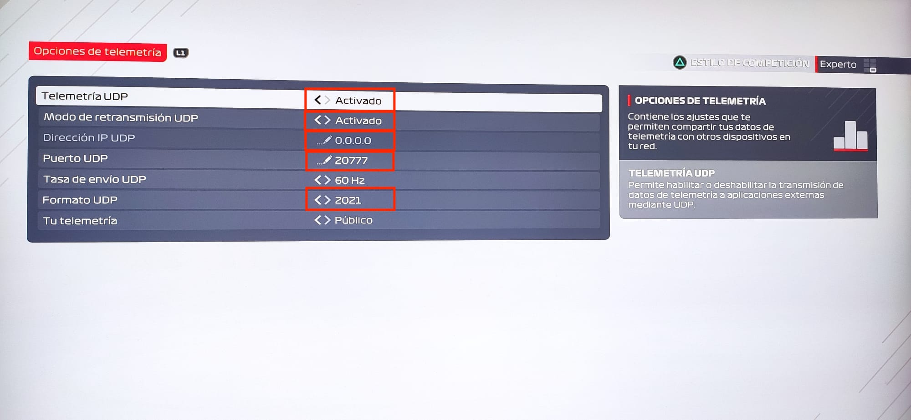

# F1 2021 UDP Telemetry Client and App


This is a TypeScript UDP client, telemetry parser, and app for Codemaster F1 2021 videogame.

The F1 series of games support the outputting of key game data via a UDP data stream. This data can be interpreted by external apps or connected peripherals for a range of different uses, including providing additional telemetry information, customised HUD displays, motion platform hardware support or providing force feedback data for custom steering wheels.

In this repo, can show the data in app do it with powerful StencilJS. Can show the data in a webpage and you can use it to do a plugin of Twitch.

## Installing

```bash
npm i
```

## Usage

In the game, you must activate the options market in red ad is



When you have UDP telemetry activated in the F1 2021 game, we can start the server.

```bash
npm run start
```
