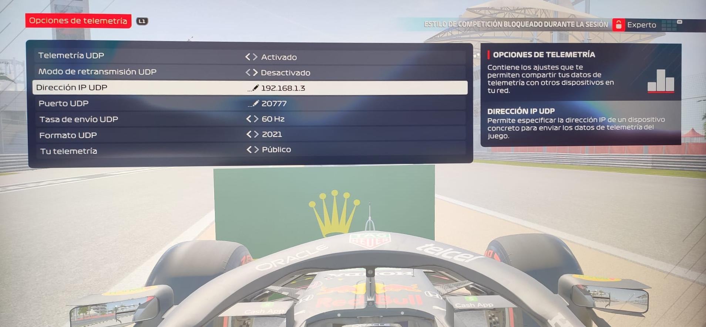

# F1 2021 UDP Telemetry Client and App


This is a TypeScript UDP client, telemetry parser, and app for Codemaster F1 2021 videogame.

The F1 series of games support the outputting of key game data via a UDP data stream. This data can be interpreted by external apps or connected peripherals for a range of different uses, including providing additional telemetry information, customised HUD displays, motion platform hardware support or providing force feedback data for custom steering wheels.

In this repo, can show the data in app do it with powerful StencilJS. Can show the data in a webpage and you can use it to do a plugin of Twitch.

## Installing

```bash
npm i
```

## Usage

In the game, you must activate the options market in red ad is



When you have UDP telemetry activated in the F1 2021 game, we can start the WebSocket Server.

```bash
npm run ws-server:start
```

After this we must start the F1 UDP clients, and WebSocket

```bash
npm run start:server
```

You can now see the information that the game gives you.


## Documentation

The official Codemasters documentation on UDP packages, you will find it in the official thread about it in the Codemasters forums.

[F1 2021 UDP Spec](https://forums.codemasters.com/topic/80231-f1-2021-udp-specification/)

## License

Licensed under the MIT license, and the project is originally fork of [f1-2021-udp](https://github.com/PrimeGoose/f1-2021-udp/)

## Support

If you want to help me improve the project, you can invite me to a coffee and appear as a patron :D

[](https://www.buymeacoffee.com/mrcodedev "Buy me a coffee :D")

## Data Output from F1 2021

### Contents

- [Data Output from F1 2021](#data-output-from-f1-2021)
  - [Contents](#contents)
  - [Overview](#overview)
  - [Packet Information](#packet-information)
    - [Packet Types](#packet-types)
    - [Packet Header](#packet-header)
  - [Packet IDs](#packet-ids)
    - [Motion Packet](#motion-packet)
    - [Session Packet](#session-packet)
    - [Lap Data Packet](#lap-data-packet)
    - [Event Packet](#event-packet)
    - [Event String Codes](#event-string-codes)
    - [Participants Packet](#participants-packet)
    - [Car Setups Packet](#car-setups-packet)
    - [Car Telemetry Packet](#car-telemetry-packet)
    - [Car Status Packet](#car-status-packet)
    - [Final Classification Packet](#final-classification-packet)
    - [Lobby Info Packet](#lobby-info-packet)
    - [Car Damage Packet](#car-damage-packet)
    - [Session History Packet](#session-history-packet)
    - [Restricted data (Your Telemetry setting)](#restricted-data-your-telemetry-setting)
      - [Car status packet](#car-status-packet-1)
      - [Car damage packet](#car-damage-packet-1)
  - [FAQS](#faqs)
    - [How do I enable the UDP Telemetry Output?](#how-do-i-enable-the-udp-telemetry-output)
    - [What has changed since last year?](#what-has-changed-since-last-year)
    - [What is the order of the wheel arrays?](#what-is-the-order-of-the-wheel-arrays)
    - [Do the vehicle indices change?](#do-the-vehicle-indices-change)
    - [What encoding format is used?](#what-encoding-format-is-used)
    - [Are the data structures packed?](#are-the-data-structures-packed)
    - [Will there always be 20 cars in the data structures?](#will-there-always-be-20-cars-in-the-data-structures)
    - [How often are updated packets sent?](#how-often-are-updated-packets-sent)
      - [Packets sent on Frame 1: (All packets sent on this frame have “Session timestamp” 0.000)](#packets-sent-on-frame-1-all-packets-sent-on-this-frame-have-session-timestamp-0000)
      - [Packets sent on Frame 2: (All packets sent on this frame have “Session timestamp” 0.016)](#packets-sent-on-frame-2-all-packets-sent-on-this-frame-have-session-timestamp-0016)
      - [Packets sent on Frame 31: (All packets sent on this frame have “Session timestamp” 0.5)](#packets-sent-on-frame-31-all-packets-sent-on-this-frame-have-session-timestamp-05)
    - [Will my old app still work with F1 2021?](#will-my-old-app-still-work-with-f1-2021)
    - [How do I enable D-BOX output?](#how-do-i-enable-d-box-output)
    - [How can I disable in-game support for LED device?](#how-can-i-disable-in-game-support-for-led-device)
    - [Can I configure the UDP output using an XML File?](#can-i-configure-the-udp-output-using-an-xml-file)
  - [Appendices](#appendices)
    - [Team IDs](#team-ids)
    - [Driver IDs](#driver-ids)
    - [Track IDs](#track-ids)
    - [Nationality IDs](#nationality-ids)
    - [Surface types](#surface-types)
    - [Button flags](#button-flags)
    - [Penalty types](#penalty-types)
    - [Infringement types](#infringement-types)

### Overview

The F1 series of games support the output of certain game data across UDP connections. This data can be used supply race information to external applications, or to drive certain hardware (e.g. motion platforms, force feedback steering wheels and LED devices).

The following information summarise these data structures so that developers of supporting hardware or software can configure these to work correctly with the F1 game.

> Note: To ensure that you are using the latest specification for this game, please check our official forum page [here](https://forums.codemasters.com/topic/80231-f1-2021-udp-specification/).

If you cannot find the information that you require then please contact the team via the official Codemasters forum thread listed above, or raise a bug report through the F1 2021 forum, and a member of the team will respond to your query as soon as possible.

### Packet Information

### Packet Types

Each packet can now carry different types of data rather than having one packet which contains everything. A header has been added to each packet as well so that versioning can be tracked and it will be easier for applications to check they are interpreting the incoming data in the correct way. Please note that all values are encoded using Little Endian format. All data is packed.

The following data types are used in the structures:

| Type   | Description             |
| ------ | ----------------------- |
| uint8  | Unsigned 8-bit integer  |
| int8   | Signed 8-bit integer    |
| uint16 | Unsigned 16-bit integer |
| int16  | Signed 16-bit integer   |
| uint32 | Unsigned 32-bit integer |
| float  | Floating point (32-bit) |
| uint64 | Unsigned 64-bit integer |

### Packet Header

Each packet has the following header:

```c#
struct PacketHeader
{
    uint16    m_packetFormat;            // 2021
    uint8     m_gameMajorVersion;        // Game major version - "X.00"
    uint8     m_gameMinorVersion;        // Game minor version - "1.XX"
    uint8     m_packetVersion;           // Version of this packet type,
                                         // all start from 1
    uint8     m_packetId;                // Identifier for the packet type,
                                         // see below
    uint64    m_sessionUID;              // Unique identifier for the session
    float     m_sessionTime;             // Session timestamp
    uint32    m_frameIdentifier;         // Identifier for the frame the data
                                         // was retrieved on
    uint8     m_playerCarIndex;          // Index of player's car in the array
    uint8     m_secondaryPlayerCarIndex; // Index of secondary player's car in
                                         // the array (split-screen)
                                         // 255 if no second player
};

```

### Packet IDs

The packets IDs are as follows:

| Packet Name          | Value | Description                                                                      |
| -------------------- | ----- | -------------------------------------------------------------------------------- |
| Motion               | 0     | Contains all motion data for player’s car – only sent while player is in control |
| Session              | 1     | Data about the session – track, time left                                        |
| Lap Data             | 2     | Data about all the lap times of cars in the session                              |
| Event                | 3     | Various notable events that happen during a session                              |
| Participants         | 4     | List of participants in the session, mostly relevant for multiplayer             |
| Car Setups           | 5     | Packet detailing car setups for cars in the race                                 |
| Car Telemetry        | 6     | Telemetry data for all cars                                                      |
| Car Status           | 7     | Status data for all cars                                                         |
| Final Classification | 8     | Final classification confirmation at the end of a race                           |
| Lobby Info           | 9     | Information about players in a multiplayer lobby                                 |
| Car Damage           | 10    | Damage status for all cars                                                       |
| Session History      | 11    | Lap and tyre data for session                                                    |

### Motion Packet

The motion packet gives physics data for all the cars being driven. There is additional data for the car being driven with the goal of being able to drive a motion platform setup.
N.B. For the normalised vectors below, to convert to float values divide by 32767.0f – 16-bit signed values are used to pack the data and on the assumption that direction values are always between -1.0f and 1.0f.

Frequency: Rate as specified in menus
Size: `1464 bytes`
Version: 1

```c#
struct CarMotionData
{
    float         m_worldPositionX;           // World space X position
    float         m_worldPositionY;           // World space Y position
    float         m_worldPositionZ;           // World space Z position
    float         m_worldVelocityX;           // Velocity in world space X
    float         m_worldVelocityY;           // Velocity in world space Y
    float         m_worldVelocityZ;           // Velocity in world space Z
    int16         m_worldForwardDirX;         // World space forward X direction (normalised)
    int16         m_worldForwardDirY;         // World space forward Y direction (normalised)
    int16         m_worldForwardDirZ;         // World space forward Z direction (normalised)
    int16         m_worldRightDirX;           // World space right X direction (normalised)
    int16         m_worldRightDirY;           // World space right Y direction (normalised)
    int16         m_worldRightDirZ;           // World space right Z direction (normalised)
    float         m_gForceLateral;            // Lateral G-Force component
    float         m_gForceLongitudinal;       // Longitudinal G-Force component
    float         m_gForceVertical;           // Vertical G-Force component
    float         m_yaw;                      // Yaw angle in radians
    float         m_pitch;                    // Pitch angle in radians
    float         m_roll;                     // Roll angle in radians
};
```

```c#
struct PacketMotionData
{
    PacketHeader    m_header;                 // Header

    CarMotionData   m_carMotionData:[22];     // Data for all cars on track
                                                // Extra player car ONLY data
    float         m_suspensionPosition[4];       // Note: All wheel arrays have the following order:
    float         m_suspensionVelocity[4];       // RL, RR, FL, FR
    float         m_suspensionAcceleration[4];   // RL, RR, FL, FR
    float         m_wheelSpeed[4];               // Speed of each wheel
    float         m_wheelSlip[4];                // Slip ratio for each wheel
    float         m_localVelocityX;              // Velocity in local space
    float         m_localVelocityY;              // Velocity in local space
    float         m_localVelocityZ;              // Velocity in local space
    float         m_angularVelocityX;            // Angular velocity x-component
    float         m_angularVelocityY;            // Angular velocity y-component
    float         m_angularVelocityZ;            // Angular velocity z-component
    float         m_angularAccelerationX;        // Angular velocity x-component
    float         m_angularAccelerationY;        // Angular velocity y-component
    float         m_angularAccelerationZ;        // Angular velocity z-component
    float         m_frontWheelsAngle;            // Current front wheels angle in radians
};

```

### Session Packet

The session packet includes details about the current session in progress.

Frequency: 2 per second
Size: `625 bytes`
Version: 1

```c#
struct MarshalZone
{
    float  m_zoneStart;   // Fraction (0..1) of way through the lap the marshal zone starts
    int8   m_zoneFlag;    // -1 = invalid/unknown, 0 = none, 1 = green, 2 = blue, 3 = yellow, 4 = red
};

struct WeatherForecastSample
{
    uint8     m_sessionType;              // 0 = unknown, 1 = P1, 2 = P2, 3 = P3, 4 = Short P, 5 = Q1
                                          // 6 = Q2, 7 = Q3, 8 = Short Q, 9 = OSQ, 10 = R, 11 = R2
                                          // 12 = Time Trial
    uint8     m_timeOffset;               // Time in minutes the forecast is for
    uint8     m_weather;                  // Weather - 0 = clear, 1 = light cloud, 2 = overcast
                                          // 3 = light rain, 4 = heavy rain, 5 = storm
    int8      m_trackTemperature;         // Track temp. in degrees Celsius
    int8      m_trackTemperatureChange;   // Track temp. change – 0 = up, 1 = down, 2 = no change
    int8      m_airTemperature;           // Air temp. in degrees celsius
    int8      m_airTemperatureChange;     // Air temp. change – 0 = up, 1 = down, 2 = no change
    uint8     m_rainPercentage;           // Rain percentage (0-100)
};

struct PacketSessionData
{
    PacketHeader    m_header;               // Header

    uint8           m_weather;              // Weather - 0 = clear, 1 = light cloud, 2 = overcast
                                            // 3 = light rain, 4 = heavy rain, 5 = storm
    int8          m_trackTemperature;       // Track temp. in degrees celsius
    int8          m_airTemperature;         // Air temp. in degrees celsius
    uint8           m_totalLaps;            // Total number of laps in this race
    uint16          m_trackLength;          // Track length in metres
    uint8           m_sessionType;          // 0 = unknown, 1 = P1, 2 = P2, 3 = P3, 4 = Short P
                                            // 5 = Q1, 6 = Q2, 7 = Q3, 8 = Short Q, 9 = OSQ
                                            // 10 = R, 11 = R2, 12 = R3, 13 = Time Trial
    int8            m_trackId;              // -1 for unknown, 0-21 for tracks, see appendix
    uint8           m_formula;              // Formula, 0 = F1 Modern, 1 = F1 Classic, 2 = F2,
                                            // 3 = F1 Generic
    uint16          m_sessionTimeLeft;      // Time left in session in seconds
    uint16          m_sessionDuration;      // Session duration in seconds
    uint8           m_pitSpeedLimit;        // Pit speed limit in kilometres per hour
    uint8           m_gamePaused;           // Whether the game is paused
    uint8           m_isSpectating;         // Whether the player is spectating
    uint8           m_spectatorCarIndex;    // Index of the car being spectated
    uint8           m_sliProNativeSupport;  // SLI Pro support, 0 = inactive, 1 = active
    uint8           m_numMarshalZones;      // Number of marshal zones to follow
    MarshalZone     m_marshalZones[21];     // List of marshal zones – max 21
    uint8           m_safetyCarStatus;      // 0 = no safety car, 1 = full
                                            // 2 = virtual, 3 = formation lap
    uint8           m_networkGame;          // 0 = offline, 1 = online
    uint8           m_numWeatherForecastSamples; // Number of weather samples to follow
    WeatherForecastSample m_weatherForecastSamples[56];   // Array of weather forecast samples
    uint8           m_forecastAccuracy;          // 0 = Perfect, 1 = Approximate
    uint8           m_aiDifficulty;              // AI Difficulty rating – 0-110
    uint32          m_seasonLinkIdentifier;      // Identifier for season - persists across saves
    uint32          m_weekendLinkIdentifier;     // Identifier for weekend - persists across saves
    uint32          m_sessionLinkIdentifier;     // Identifier for session - persists across saves
    uint8           m_pitStopWindowIdealLap;     // Ideal lap to pit on for current strategy (player)
    uint8           m_pitStopWindowLatestLap;    // Latest lap to pit on for current strategy (player)
    uint8           m_pitStopRejoinPosition;     // Predicted position to rejoin at (player)
    uint8           m_steeringAssist;            // 0 = off, 1 = on
    uint8           m_brakingAssist;             // 0 = off, 1 = low, 2 = medium, 3 = high
    uint8           m_gearboxAssist;             // 1 = manual, 2 = manual & suggested gear, 3 = auto
    uint8           m_pitAssist;                 // 0 = off, 1 = on
    uint8           m_pitReleaseAssist;          // 0 = off, 1 = on
    uint8           m_ERSAssist;                 // 0 = off, 1 = on
    uint8           m_DRSAssist;                 // 0 = off, 1 = on
    uint8           m_dynamicRacingLine;         // 0 = off, 1 = corners only, 2 = full
    uint8           m_dynamicRacingLineType;     // 0 = 2D, 1 = 3D
};

```

### Lap Data Packet

The lap data packet gives details of all the cars in the session.

Frequency: Rate as specified in menus
Size: `970 bytes`
Version: 1

```c#
struct LapData
{
    uint32   m_lastLapTimeInMS;           // Last lap time in milliseconds
    uint32   m_currentLapTimeInMS;        // Current time around the lap in milliseconds
    uint16   m_sector1TimeInMS;           // Sector 1 time in milliseconds
    uint16   m_sector2TimeInMS;           // Sector 2 time in milliseconds
    float    m_lapDistance; // Distance vehicle is around current lap in metres – could
    // be negative if line hasn’t been crossed yet
    float    m_totalDistance; // Total distance travelled in session in metres – could
    // be negative if line hasn’t been crossed yet
    float    m_safetyCarDelta;            // Delta in seconds for safety car
    uint8    m_carPosition;               // Car race position
    uint8    m_currentLapNum;            // Current lap number
    uint8    m_pitStatus;                // 0 = none, 1 = pitting, 2 = in pit area
    uint8    m_numPitStops;              // Number of pit stops taken in this race
    uint8    m_sector;                   // 0 = sector1, 1 = sector2, 2 = sector3
    uint8    m_currentLapInvalid;        // Current lap invalid - 0 = valid, 1 = invalid
    uint8    m_penalties;               // Accumulated time penalties in seconds to be added
    uint8    m_warnings;                  // Accumulated number of warnings issued
    uint8    m_numUnservedDriveThroughPens;  // Num drive through pens left to serve
    uint8    m_numUnservedStopGoPens;        // Num stop go pens left to serve
    uint8    m_gridPosition;         	 // Grid position the vehicle started the race in
    uint8    m_driverStatus;         	 // Status of driver - 0 = in garage, 1 = flying lap
                                          // 2 = in lap, 3 = out lap, 4 = on track
    uint8    m_resultStatus;              // Result status - 0 = invalid, 1 = inactive, 2 = active
                                          // 3 = finished, 4 = didnotfinish, 5 = disqualified
                                          // 6 = not classified, 7 = retired
    uint8    m_pitLaneTimerActive;     	 // Pit lane timing, 0 = inactive, 1 = active
    uint16   m_pitLaneTimeInLaneInMS;   	 // If active, the current time spent in the pit lane in ms
    uint16   m_pitStopTimerInMS;        	 // Time of the actual pit stop in ms
    uint8    m_pitStopShouldServePen;   	 // Whether the car should serve a penalty at this stop
};


struct PacketLapData
{
    PacketHeader    m_header;              // Header

    LapData         m_lapData[22];         // Lap data for all cars on track
};
```

### Event Packet

This packet gives details of events that happen during the course of a session.

Frequency: When the event occurs
Size: `36 bytes`
Version: 1

```c#
// The event details packet is different for each type of event.
// Make sure only the correct type is interpreted.
union EventDataDetails
{
    struct
    {
        uint8	vehicleIdx; // Vehicle index of car achieving fastest lap
        float	lapTime;    // Lap time is in seconds
    } FastestLap;

    struct
    {
        uint8   vehicleIdx; // Vehicle index of car retiring
    } Retirement;

    struct
    {
        uint8   vehicleIdx; // Vehicle index of team mate
    } TeamMateInPits;

    struct
    {
        uint8   vehicleIdx; // Vehicle index of the race winner
    } RaceWinner;

    struct
    {
    	uint8 penaltyType;		// Penalty type – see Appendices
        uint8 infringementType;		// Infringement type – see Appendices
        uint8 vehicleIdx;         	// Vehicle index of the car the penalty is applied to
        uint8 otherVehicleIdx;    	// Vehicle index of the other car involved
        uint8 time;               	// Time gained, or time spent doing action in seconds
        uint8 lapNum;             	// Lap the penalty occurred on
        uint8 placesGained;       	// Number of places gained by this
    } Penalty;

    struct
    {
        uint8 vehicleIdx;		// Vehicle index of the vehicle triggering speed trap
        float speed;      		// Top speed achieved in kilometres per hour
        uint8 overallFastestInSession;   // Overall fastest speed in session = 1, otherwise 0
        uint8 driverFastestInSession;    // Fastest speed for driver in session = 1, otherwise 0
    } SpeedTrap;

    struct
    {
        uint8 numLights;		// Number of lights showing
    } StartLIghts;

    struct
    {
        uint8 vehicleIdx;                 // Vehicle index of the vehicle serving drive through
    } DriveThroughPenaltyServed;

    struct
    {
        uint8 vehicleIdx;                 // Vehicle index of the vehicle serving stop go
    } StopGoPenaltyServed;

    struct
    {
        uint32 flashbackFrameIdentifier;  // Frame identifier flashed back to
        float flashbackSessionTime;       // Session time flashed back to
    } Flashback;

    struct
    {
        uint32         m_buttonStatus;    // Bit flags specifying which buttons are being pressed
                                          // currently - see appendices
    } Buttons;
};

struct PacketEventData
{
    PacketHeader    	m_header;               	// Header

    uint8           	m_eventStringCode[4];   	// Event string code, see below
    EventDataDetails	m_eventDetails;         	// Event details - should be interpreted differently
                                                 // for each type
};

```

### Event String Codes

| Event                | Code   | Description                                    |
| -------------------- | ------ | ---------------------------------------------- |
| Session Started      | “SSTA” | Sent when the session starts                   |
| Session Ended        | “SEND” | Sent when the session ends                     |
| Fastest Lap          | “FTLP” | When a driver achieves the fastest lap         |
| Retirement           | “RTMT” | When a driver retires                          |
| DRS enabled          | “DRSE” | Race control have enabled DRS                  |
| DRS disabled         | “DRSD” | Race control have disabled DRS                 |
| Team mate in pits    | “TMPT” | Your team mate has entered the pits            |
| Chequered flag       | “CHQF” | The chequered flag has been waved              |
| Race Winner          | “RCWN” | The race winner is announced                   |
| Penalty Issued       | “PENA” | A penalty has been issued – details in event   |
| Speed Trap Triggered | “SPTP” | Speed trap has been triggered by fastest speed |
| Start lights         | “STLG” | Start lights – number shown                    |
| Lights out           | “LGOT” | Lights out                                     |
| Drive through served | “DTSV” | Drive through penalty served                   |
| Stop go served       | “SGSV” | Stop go penalty served                         |
| Flashback            | “FLBK” | Flashback activated                            |
| Button status        | “BUTN” | Button status changed                          |

### Participants Packet

This is a list of participants in the race. If the vehicle is controlled by AI, then the name will be the driver name. If this is a multiplayer game, the names will be the Steam Id on PC, or the LAN name if appropriate.

N.B. on Xbox One, the names will always be the driver name, on PS4 the name will be the LAN name if playing a LAN game, otherwise it will be the driver name.

The array should be indexed by vehicle index.

Frequency: Every 5 seconds
Size: `1257 bytes`
Version: 1

```c#
struct ParticipantData
{
    uint8      m_aiControlled;           // Whether the vehicle is AI (1) or Human (0) controlled
    uint8      m_driverId;		// Driver id - see appendix, 255 if network human
    uint8      m_networkId;		// Network id – unique identifier for network players
    uint8      m_teamId;                 // Team id - see appendix
    uint8      m_myTeam;                 // My team flag – 1 = My Team, 0 = otherwise
    uint8      m_raceNumber;             // Race number of the car
    uint8      m_nationality;            // Nationality of the driver
    char       m_name[48];               // Name of participant in UTF-8 format – null terminated
					// Will be truncated with … (U+2026) if too long
    uint8      m_yourTelemetry;          // The player's UDP setting, 0 = restricted, 1 = public
};

struct PacketParticipantsData
{
    PacketHeader    m_header;            // Header

    uint8           m_numActiveCars;	// Number of active cars in the data – should match number of
                                         // cars on HUD
    ParticipantData m_participants[22];
};

```

### Car Setups Packet

This packet details the car setups for each vehicle in the session. Note that in multiplayer games, other player cars will appear as blank, you will only be able to see your car setup and AI cars.

Frequency: 2 per second
Size: `1102 bytes`
Version: 1

```c#
struct CarSetupData
{
    uint8     m_frontWing;                // Front wing aero
    uint8     m_rearWing;                 // Rear wing aero
    uint8     m_onThrottle;               // Differential adjustment on throttle (percentage)
    uint8     m_offThrottle;              // Differential adjustment off throttle (percentage)
    float     m_frontCamber;              // Front camber angle (suspension geometry)
    float     m_rearCamber;               // Rear camber angle (suspension geometry)
    float     m_frontToe;                 // Front toe angle (suspension geometry)
    float     m_rearToe;                  // Rear toe angle (suspension geometry)
    uint8     m_frontSuspension;          // Front suspension
    uint8     m_rearSuspension;           // Rear suspension
    uint8     m_frontAntiRollBar;         // Front anti-roll bar
    uint8     m_rearAntiRollBar;          // Front anti-roll bar
    uint8     m_frontSuspensionHeight;    // Front ride height
    uint8     m_rearSuspensionHeight;     // Rear ride height
    uint8     m_brakePressure;            // Brake pressure (percentage)
    uint8     m_brakeBias;                // Brake bias (percentage)
    float     m_rearLeftTyrePressure;     // Rear left tyre pressure (PSI)
    float     m_rearRightTyrePressure;    // Rear right tyre pressure (PSI)
    float     m_frontLeftTyrePressure;    // Front left tyre pressure (PSI)
    float     m_frontRightTyrePressure;   // Front right tyre pressure (PSI)
    uint8     m_ballast;                  // Ballast
    float     m_fuelLoad;                 // Fuel load
};

struct PacketCarSetupData
{
    PacketHeader    m_header;            // Header

    CarSetupData    m_carSetups[22];
};
```

### Car Telemetry Packet

This packet details telemetry for all the cars in the race. It details various values that would be recorded on the car such as speed, throttle application, DRS etc. Note that the rev light configurations are presented separately as well and will mimic real life driver preferences.

Frequency: Rate as specified in menus
Size: `1347 bytes`
Version: 1

```c#
struct CarTelemetryData
{
    uint16    m_speed;                    // Speed of car in kilometres per hour
    float     m_throttle;                 // Amount of throttle applied (0.0 to 1.0)
    float     m_steer;                    // Steering (-1.0 (full lock left) to 1.0 (full lock right))
    float     m_brake;                    // Amount of brake applied (0.0 to 1.0)
    uint8     m_clutch;                   // Amount of clutch applied (0 to 100)
    int8      m_gear;                     // Gear selected (1-8, N=0, R=-1)
    uint16    m_engineRPM;                // Engine RPM
    uint8     m_drs;                      // 0 = off, 1 = on
    uint8     m_revLightsPercent;         // Rev lights indicator (percentage)
    uint16    m_revLightsBitValue;        // Rev lights (bit 0 = leftmost LED, bit 14 = rightmost LED)
    uint16    m_brakesTemperature[4];     // Brakes temperature (celsius)
    uint8     m_tyresSurfaceTemperature[4]; // Tyres surface temperature (celsius)
    uint8     m_tyresInnerTemperature[4]; // Tyres inner temperature (celsius)
    uint16    m_engineTemperature;        // Engine temperature (celsius)
    float     m_tyresPressure[4];         // Tyres pressure (PSI)
    uint8     m_surfaceType[4];           // Driving surface, see appendices
};

struct PacketCarTelemetryData
{
    PacketHeader    	m_header;	      // Header

    CarTelemetryData    m_carTelemetryData[22];

    uint8               m_mfdPanelIndex;       // Index of MFD panel open - 255 = MFD closed
                                               // Single player, race – 0 = Car setup, 1 = Pits
                                               // 2 = Damage, 3 =  Engine, 4 = Temperatures
                                               // May vary depending on game mode
    uint8               m_mfdPanelIndexSecondaryPlayer;   // See above
    int8                m_suggestedGear;       // Suggested gear for the player (1-8)
                                               // 0 if no gear suggested
};

```

### Car Status Packet

This packet details car statuses for all the cars in the race.

Frequency: Rate as specified in menus
Size: `1058 bytes`
Version: 1

```c#
struct CarStatusData
{
    uint8       m_tractionControl;          // Traction control - 0 = off, 1 = medium, 2 = full
    uint8       m_antiLockBrakes;           // 0 (off) - 1 (on)
    uint8       m_fuelMix;                  // Fuel mix - 0 = lean, 1 = standard, 2 = rich, 3 = max
    uint8       m_frontBrakeBias;           // Front brake bias (percentage)
    uint8       m_pitLimiterStatus;         // Pit limiter status - 0 = off, 1 = on
    float       m_fuelInTank;               // Current fuel mass
    float       m_fuelCapacity;             // Fuel capacity
    float       m_fuelRemainingLaps;        // Fuel remaining in terms of laps (value on MFD)
    uint16      m_maxRPM;                   // Cars max RPM, point of rev limiter
    uint16      m_idleRPM;                  // Cars idle RPM
    uint8       m_maxGears;                 // Maximum number of gears
    uint8       m_drsAllowed;               // 0 = not allowed, 1 = allowed
    uint16      m_drsActivationDistance;    // 0 = DRS not available, non-zero - DRS will be available
                                            // in [X] metres
    uint8       m_actualTyreCompound;	   // F1 Modern - 16 = C5, 17 = C4, 18 = C3, 19 = C2, 20 = C1
   					   // 7 = inter, 8 = wet
   					   // F1 Classic - 9 = dry, 10 = wet
   					   // F2 – 11 = super soft, 12 = soft, 13 = medium, 14 = hard
   					   // 15 = wet
    uint8       m_visualTyreCompound;       // F1 visual (can be different from actual compound)
                                            // 16 = soft, 17 = medium, 18 = hard, 7 = inter, 8 = wet
                                            // F1 Classic – same as above
                                            // F2 ‘19, 15 = wet, 19 – super soft, 20 = soft
                                            // 21 = medium , 22 = hard
    uint8       m_tyresAgeLaps;             // Age in laps of the current set of tyres
    int8        m_vehicleFiaFlags;	   // -1 = invalid/unknown, 0 = none, 1 = green
                                            // 2 = blue, 3 = yellow, 4 = red
    float       m_ersStoreEnergy;           // ERS energy store in Joules
    uint8       m_ersDeployMode;            // ERS deployment mode, 0 = none, 1 = medium
   					   // 2 = hotlap, 3 = overtake
    float       m_ersHarvestedThisLapMGUK;  // ERS energy harvested this lap by MGU-K
    float       m_ersHarvestedThisLapMGUH;  // ERS energy harvested this lap by MGU-H
    float       m_ersDeployedThisLap;       // ERS energy deployed this lap
    uint8       m_networkPaused;            // Whether the car is paused in a network game
};


struct PacketCarStatusData
{
    PacketHeader    	m_header;	   // Header

    CarStatusData	m_carStatusData[22];
};
```

### Final Classification Packet

This packet details the final classification at the end of the race, and the data will match with the post race results screen. This is especially useful for multiplayer games where it is not always possible to send lap times on the final frame because of network delay.

Frequency: Once at the end of a race
Size: `839 bytes`
Version: 1

```c#
struct FinalClassificationData
{
    uint8     m_position;              // Finishing position
    uint8     m_numLaps;               // Number of laps completed
    uint8     m_gridPosition;          // Grid position of the car
    uint8     m_points;                // Number of points scored
    uint8     m_numPitStops;           // Number of pit stops made
    uint8     m_resultStatus;          // Result status - 0 = invalid, 1 = inactive, 2 = active
                                       // 3 = finished, 4 = didnotfinish, 5 = disqualified
                                       // 6 = not classified, 7 = retired
    uint32    m_bestLapTimeInMS;       // Best lap time of the session in milliseconds
    double    m_totalRaceTime;         // Total race time in seconds without penalties
    uint8     m_penaltiesTime;         // Total penalties accumulated in seconds
    uint8     m_numPenalties;          // Number of penalties applied to this driver
    uint8     m_numTyreStints;         // Number of tyres stints up to maximum
    uint8     m_tyreStintsActual[8];   // Actual tyres used by this driver
    uint8     m_tyreStintsVisual[8];   // Visual tyres used by this driver
};
struct PacketFinalClassificationData
{
    PacketHeader    m_header;                      // Header

    uint8                      m_numCars;          // Number of cars in the final classification
    FinalClassificationData    m_classificationData[22];
};

```

### Lobby Info Packet

This packet details the players currently in a multiplayer lobby. It details each player’s selected car, any AI involved in the game and also the ready status of each of the participants.

Frequency: Two every second when in the lobby
Size: `1191 bytes`
Version: 1

```c#
struct LobbyInfoData
{
    uint8     m_aiControlled;            // Whether the vehicle is AI (1) or Human (0) controlled
    uint8     m_teamId;                  // Team id - see appendix (255 if no team currently selected)
    uint8     m_nationality;             // Nationality of the driver
    char      m_name[48]; // Name of participant in UTF-8 format – null terminated
                                         // Will be truncated with ... (U+2026) if too long
    uint8     m_carNumber;               // Car number of the player
    uint8     m_readyStatus;             // 0 = not ready, 1 = ready, 2 = spectating
};

struct PacketLobbyInfoData
{
    PacketHeader    m_header;                       // Header

    // Packet specific data
    uint8               m_numPlayers;               // Number of players in the lobby data
    LobbyInfoData       m_lobbyPlayers[22];
};
```

### Car Damage Packet

This packet details car damage parameters for all the cars in the race.

Frequency: 2 per second
Size: `882 bytes`
Version: 1

```c#
struct CarDamageData
{
    float     m_tyresWear[4];                     // Tyre wear (percentage)
    uint8     m_tyresDamage[4];                   // Tyre damage (percentage)
    uint8     m_brakesDamage[4];                  // Brakes damage (percentage)
    uint8     m_frontLeftWingDamage;              // Front left wing damage (percentage)
    uint8     m_frontRightWingDamage;             // Front right wing damage (percentage)
    uint8     m_rearWingDamage;                   // Rear wing damage (percentage)
    uint8     m_floorDamage;                      // Floor damage (percentage)
    uint8     m_diffuserDamage;                   // Diffuser damage (percentage)
    uint8     m_sidepodDamage;                    // Sidepod damage (percentage)
    uint8     m_drsFault;                         // Indicator for DRS fault, 0 = OK, 1 = fault
    uint8     m_gearBoxDamage;                    // Gear box damage (percentage)
    uint8     m_engineDamage;                     // Engine damage (percentage)
    uint8     m_engineMGUHWear;                   // Engine wear MGU-H (percentage)
    uint8     m_engineESWear;                     // Engine wear ES (percentage)
    uint8     m_engineCEWear;                     // Engine wear CE (percentage)
    uint8     m_engineICEWear;                    // Engine wear ICE (percentage)
    uint8     m_engineMGUKWear;                   // Engine wear MGU-K (percentage)
    uint8     m_engineTCWear;                     // Engine wear TC (percentage)
}

struct PacketCarDamageData
{
    PacketHeader    m_header;               // Header

    CarDamageData   m_carDamageData[22];
};

```

### Session History Packet

This packet contains lap times and tyre usage for the session. This packet works slightly differently to other packets. To reduce CPU and bandwidth, each packet relates to a specific vehicle and is sent every 1/20 s, and the vehicle being sent is cycled through. Therefore in a 20 car race you should receive an update for each vehicle at least once per second.

Note that at the end of the race, after the final classification packet has been sent, a final bulk update of all the session histories for the vehicles in that session will be sent.

Frequency: 20 per second but cycling through cars
Size: `1155 bytes`
Version: 1

```c#
struct LapHistoryData
{
    uint32    m_lapTimeInMS;           // Lap time in milliseconds
    uint16    m_sector1TimeInMS;       // Sector 1 time in milliseconds
    uint16    m_sector2TimeInMS;       // Sector 2 time in milliseconds
    uint16    m_sector3TimeInMS;       // Sector 3 time in milliseconds
    uint8     m_lapValidBitFlags;      // 0x01 bit set-lap valid,      0x02 bit set-sector 1 valid
                                       // 0x04 bit set-sector 2 valid, 0x08 bit set-sector 3 valid
};

struct TyreStintHistoryData
{
    uint8     m_endLap;                // Lap the tyre usage ends on (255 of current tyre)
    uint8     m_tyreActualCompound;    // Actual tyres used by this driver
    uint8     m_tyreVisualCompound;    // Visual tyres used by this driver
};

struct PacketSessionHistoryData
{
    PacketHeader  m_header;                   // Header

    uint8         m_carIdx;                   // Index of the car this lap data relates to
    uint8         m_numLaps;                  // Num laps in the data (including current partial lap)
    uint8         m_numTyreStints;            // Number of tyre stints in the data

    uint8         m_bestLapTimeLapNum;        // Lap the best lap time was achieved on
    uint8         m_bestSector1LapNum;        // Lap the best Sector 1 time was achieved on
    uint8         m_bestSector2LapNum;        // Lap the best Sector 2 time was achieved on
    uint8         m_bestSector3LapNum;        // Lap the best Sector 3 time was achieved on

    LapHistoryData          m_lapHistoryData[100];	// 100 laps of data max
    TyreStintHistoryData    m_tyreStintsHistoryData[8];
};
```

### Restricted data (Your Telemetry setting)

There is some data in the UDP that you may not want other players seeing if you are in a multiplayer game. This is controlled by the “Your Telemetry” setting in the Telemetry options. The options are:

- Restricted (Default) – other players viewing the UDP data will not see values for your car
- Public – all other players can see all the data for your car

Note: You can always see the data for the car you are driving regardless of the setting.

The following data items are set to zero if the player driving the car in question has their “Your Telemetry” set to “Restricted”:

#### Car status packet

- m_fuelInTank
- m_fuelCapacity
- m_fuelMix
- m_fuelRemainingLaps
- m_frontBrakeBias
- m_ersDeployMode
- m_ersStoreEnergy
- m_ersDeployedThisLap
- m_ersHarvestedThisLapMGUK
- m_ersHarvestedThisLapMGUH

#### Car damage packet

- m_frontLeftWingDamage
- m_frontRightWingDamage
- m_rearWingDamage
- m_floorDamage
- m_diffuserDamage
- m_sidepodDamage
- m_engineDamage
- m_gearBoxDamage
- m_tyresWear (All four wheels)
- m_tyresDamage (All four wheels)
- m_brakesDamage (All four wheels)
- m_drsFault
- m_engineMGUHWear
- m_engineESWear
- m_engineCEWear
- m_engineICEWear
- m_engineMGUKWear
- m_engineTCWear

## FAQS

### How do I enable the UDP Telemetry Output?

In F1 2021, UDP telemetry output is controlled via the in-game menus. To enable this, enter the options menu from the main menu (triangle / Y), then enter the settings menu - the UDP option will be at the bottom of the list. From there you will be able to enable / disable the UDP output, configure the IP address and port for the receiving application, toggle broadcast mode and set the send rate. Broadcast mode transmits the data across the network subnet to allow multiple devices on the same subnet to be able to receive this information. When using broadcast mode it is not necessary to set a target IP address, just a target port for applications to listen on.

Advanced PC Users: You can additionally edit the game’s configuration XML file to configure UDP output. The file is located here (after an initial boot of the game):

```
...\Documents\My Games\<game_folder>\hardwaresettings\hardware_settings_config.xml

```

You should see the tag:

```xml
<motion>
  ...
  <udp enabled="false" broadcast=”false” ip="127.0.0.1" port="20777" sendRate=”20” format=”2021” yourTelemetry=”restricted” />
	  ...
</motion>
```

Here you can set the values manually. Note that any changes made within the game when it is running will overwrite any changes made manually. Note the enabled flag is now a state.

### What has changed since last year?

F1 2021 sees the following changes to the UDP specification:

- Car Damage packet including new engine wear parameters, brakes damage and more detailed body damage included. Some data sizes changed.

- Damage and wear parameters moved from car status packet to car damage for consistency and to more efficiently use space
- Block rev lights have been added for showing more accurate rev light LED arrays

- Session packet has been updated with more detailed weather forecast together with accuracy setting

- Nationality IDs have been updated

- Session types have been updated

- Adding new track Ids

- Added car number in the lobby info packet

- Network identifier added to participants – previously the network Id was offset by 100, but this could be confused with valid Driver Ids as they go over 100 now

- Updated Result Status values

- Added AI difficulty to the session packet

- Added My Team flag to participants and now set invalid driver, team, nationality & network ids to 255

- Added number of pit stops to the lap data

- New “Start lights” and “Lights out” events

- Added identifiers into the session packet so data sets can be linked

- Pit stop window data for the player has been added to the session packet

- Pit stop timings for all vehicles are now available in the lap data

- New session history packet gives details of lap times and tyre usage across the session

- Removed best lap/sector times/lap numbers from Lap Data packet as all this information is now available in the Session History packet

- Assists for local player are now in the session packet

- Added num penalties unserved into lap data and events for when drive through and stop-go penalties are served

- Added num warnings a driver has been issued in the lap data

- Added network paused flag to the car status (for every car)

- Flashback event added to help figure out discontinuities in the data

- Added dynamic racing line assists

- Lap times are now all in milliseconds (lap data and final classification packets affected)

- Lap valid flags added to the session history

- Added new event for button status so it can be detected throughout the game, not just driving

- Removed the button status from the car telemetry packet as the event packet is now available

### What is the order of the wheel arrays?

All wheel arrays are in the following order:

- 0 – Rear Left (RL)
- 1 – Rear Right (RR)
- 2 – Front Left (FL)
- 3 – Front Right (FR)

### Do the vehicle indices change?

During a session, each car is assigned a vehicle index. This will not change throughout the session and all the arrays that are sent use this vehicle index to dereference the correct piece of data.

### What encoding format is used?

All values are encoded using Little Endian format.

### Are the data structures packed?

Yes, all data is packed, there is no padding used.

### Will there always be 20 cars in the data structures?

No, for F1 2020, there is a new feature called “My Team” which allows an extra team to be present on the grid. This means that all previous places where 20 cars were used, 22 is now the maximum. If “My Team” is not active however, most games modes will act as before and have a maximum of 20. Note that if your UDP format is 2019, 2018 or legacy and you are in “My Team” career mode, no UDP output will be produced because of this limitation.

There is still the data item called `m_numActiveCars` in the participants packet which tells you how many cars are active in the race. However, you should check the individual result status of each car in the lap data to see if that car is actively providing data. If it is not `“Invalid”` or `“Inactive”` then the corresponding vehicle index has valid data.

### How often are updated packets sent?

For the packets which get updated at “Rate as specified in the menus” you can be guaranteed that on the frame that these get sent they will all get sent together and will never be separated across frames. This of course relies on the reliability of your network as to whether they are received correctly as everything is sent via UDP. Other packets that get sent at specific rates can arrive on any frame.
If you are connected to the game when it starts transmitting the first frame will contain the following information to help initialise data structures on the receiving application:

#### Packets sent on Frame 1: (All packets sent on this frame have “Session timestamp” 0.000)

- Session
- Participants
- Car Setups
- Lap Data
- Motion Data
- Car Telemetry
- Car Status
- Car Damage

As an example, assuming that you are running at 60Hz with 60Hz update rate selected in the menus then you would expect to see the following packets and timestamps:

#### Packets sent on Frame 2: (All packets sent on this frame have “Session timestamp” 0.016)

- Lap Data
- Motion Data
- Car Telemetry
- Car Status

…

#### Packets sent on Frame 31: (All packets sent on this frame have “Session timestamp” 0.5)

- Session (since 2 updates per second)
- Car Setups (since 2 updates per second)
- Lap Data
- Motion Data
- Car Telemetry
- Car Status
- Car Damage (since 2 updates per second)

### Will my old app still work with F1 2021?

F1 2021 uses a new format for the UDP data. However, earlier formats of the data are still supported so that most older apps implemented using the previous data formats should work with little or no change from the developer. To use the old formats, please enter the UDP options menu and set “UDP Format” to either “F1 2020”, “F1 2019”, “F1 2018” or “Legacy” (for F1 2017 and earlier).
Specifications for the olders formats can be seen here:

- Legacy (2017 and earlier) - http://forums.codemasters.com/discussion/53139/f1-2017-d-box-and-udp-output-specification/p1.
- F1 2018 - https://forums.codemasters.com/topic/30601-f1-2018-udp-specification/
- F1 2019 - https://forums.codemasters.com/topic/44592-f1-2019-udp-specification/
- F1 2020 - https://forums.codemasters.com/topic/54423-f1%C2%AE-2020-udp-specification/

### How do I enable D-BOX output?

D-BOX output is currently supported on the PC platform. In F1 2021, the D-BOX activation can be controlled via the menus. Navigate to `Game Options->Settings->UDP Telemetry Settings->D-BOX` to activate this on your system.

Advanced PC Users: It is possible to control D-BOX by editing the games’ configuration XML file. The file is located here (after an initial boot of the game):

`...\Documents\My Games\<game_folder>\hardwaresettings\hardware_settings_config.xml`

You should see the tag:

```xml

  <motion>
    <dbox enabled="false" />
    ...
  </motion>

```

Set the `“enabled”` value to `“true”` to allow the game to output to your D-BOX motion platform. Note that any changes made within the game when it is running will overwrite any changes made manually.

### How can I disable in-game support for LED device?

The F1 game has native support for some of the basic features supported by some external LED devices, such as the Leo Bodnar SLI Pro and the Fanatec steering wheels. To avoid conflicts between Codemasters’ implementation and any third-party device managers on the PC platform it may be necessary to disable the native support. This is done using the following led_display flags in the hardware_settings_config.xml. The file is located here (after an initial boot of the game):

`...\Documents\My Games\<game_folder>\hardwaresettings\hardware_settings_config.xml`

The flags to enabled/disable LED output are:

```xml

<led_display fanatecNativeSupport="true" sliProNativeSupport="true" />

```

The sliProNativeSupport flag controls the output to SLI Pro devices. The fanatecNativeSupport flag controls the output to Fanatec (and some related) steering wheel LEDs. Set the values for any of these to “false” to disable them and avoid conflicts with your own device manager.

Please note there is an additional flag to manually control the LED brightness on the SLI Pro:

```xml
<led_display sliProForceBrightness="127" />
```

This option (using value in the range 0-255) will be ignored when setting the sliProNativeSupport flag to “false”.

Also note it is now possible to edit these values on the fly via the Game Options->Settings->UDP Telemetry Settings menu.

### Can I configure the UDP output using an XML File?

PC users can edit the game’s configuration XML file to configure UDP output. The file is located here (after an initial boot of the game):

`...\Documents\My Games\<game_folder>\hardwaresettings\hardware_settings_config.xml`

You should see the tag:

```xml
   <motion>
     ...
     <udp enabled="false" broadcast=”false” ip="127.0.0.1" port="20777" sendRate=”20” format=”2021” yourTelemetry="restricted" />
     ...
   </motion>
```

Here you can set the values manually. Note that any changes made within the game when it is running will overwrite any changes made manually.

## Appendices

Here are the values used for the team ID, driver ID and track ID parameters.

### Team IDs

| ID  | Team                      | ID  | Team              | ID  | Team |
| --- | ------------------------- | --- | ----------------- | --- | ---- |
| 0   | Mercedes                  | 76  | MP Motorsport ‘20 |     |      |
| 1   | Ferrari                   | 77  | Prema ‘20         |     |      |
| 2   | Red Bull Racing           | 78  | Trident ‘20       |     |      |
| 3   | Williams                  | 79  | BWT ‘20           |     |      |
| 4   | Aston Martin              | 80  | Hitech ‘20        |     |      |
| 5   | Alpine                    | 85  | Mercedes 2020     |     |      |
| 6   | Alpha Tauri               | 86  | Ferrari 2020      |     |      |
| 7   | Haas                      | 87  | Red Bull 2020     |     |      |
| 8   | McLaren                   | 88  | Williams 2020     |     |      |
| 9   | Alfa Romeo                | 89  | Racing Point 2020 |     |      |
| 42  | Art GP ’19                | 90  | Renault 2020      |     |      |
| 43  | Campos ’19                | 91  | Alpha Tauri 2020  |     |      |
| 44  | Carlin ’19                | 92  | Haas 2020         |     |      |
| 45  | Sauber Junior Charouz ’19 | 93  | McLaren 2020      |     |      |
| 46  | Dams ’19                  | 94  | Alfa Romeo 2020   |     |      |
| 47  | Uni-Virtuosi ‘19          |     |                   |     |      |
| 48  | MP Motorsport ‘19         |     |                   |     |      |
| 49  | Prema ’19                 |     |                   |     |      |
| 50  | Trident ’19               |     |                   |     |      |
| 51  | Arden ’19                 |     |                   |     |      |
| 70  | Art GP ‘20                |     |                   |     |      |
| 71  | Campos ‘20                |     |                   |     |      |
| 72  | Carlin ‘20                |     |                   |     |      |
| 73  | Charouz ‘20               |     |                   |     |      |
| 74  | Dams ‘20                  |     |                   |     |      |
| 75  | Uni-Virtuosi ‘20          |     |                   |     |      |

### Driver IDs

| ID  | Driver             | ID  | Driver              | ID  | Driver               |
| --- | ------------------ | --- | ------------------- | --- | -------------------- |
| 0   | Carlos Sainz       | 39  | Santiago Moreno     | 76  | Alain Prost          |
| 1   | Daniil Kvyat       | 40  | Benjamin Coppens    | 77  | Ayrton Senna         |
| 2   | Daniel Ricciardo   | 41  | Noah Visser         | 78  | Nobuharu Matsushita  |
| 3   | Fernando Alonso    | 42  | Gert Waldmuller     | 79  | Nikita Mazepin       |
| 4   | Felipe Massa       | 43  | Julian Quesada      | 80  | Guanya Zhou          |
| 6   | Kimi Räikkönen     | 44  | Daniel Jones        | 81  | Mick Schumacher      |
| 7   | Lewis Hamilton     | 45  | Artem Markelov      | 82  | Callum Ilott         |
| 9   | Max Verstappen     | 46  | Tadasuke Makino     | 83  | Juan Manuel Correa   |
| 10  | Nico Hulkenburg    | 47  | Sean Gelael         | 84  | Jordan King          |
| 11  | Kevin Magnussen    | 48  | Nyck De Vries       | 85  | Mahaveer Raghunathan |
| 12  | Romain Grosjean    | 49  | Jack Aitken         | 86  | Tatiana Calderon     |
| 13  | Sebastian Vettel   | 50  | George Russell      | 87  | Anthoine Hubert      |
| 14  | Sergio Perez       | 51  | Maximilian Günther  | 88  | Guiliano Alesi       |
| 15  | Valtteri Bottas    | 52  | Nirei Fukuzumi      | 89  | Ralph Boschung       |
| 17  | Esteban Ocon       | 53  | Luca Ghiotto        | 90  | Michael Schumacher   |
| 19  | Lance Stroll       | 54  | Lando Norris        | 91  | Dan Ticktum          |
| 20  | Arron Barnes       | 55  | Sérgio Sette Câmara | 92  | Marcus Armstrong     |
| 21  | Martin Giles       | 56  | Louis Delétraz      | 93  | Christian Lundgaard  |
| 22  | Alex Murray        | 57  | Antonio Fuoco       | 94  | Yuki Tsunoda         |
| 23  | Lucas Roth         | 58  | Charles Leclerc     | 95  | Jehan Daruvala       |
| 24  | Igor Correia       | 59  | Pierre Gasly        | 96  | Gulherme Samaia      |
| 25  | Sophie Levasseur   | 62  | Alexander Albon     | 97  | Pedro Piquet         |
| 26  | Jonas Schiffer     | 63  | Nicholas Latifi     | 98  | Felipe Drugovich     |
| 27  | Alain Forest       | 64  | Dorian Boccolacci   | 99  | Robert Schwartzman   |
| 28  | Jay Letourneau     | 65  | Niko Kari           | 100 | Roy Nissany          |
| 29  | Esto Saari         | 66  | Roberto Merhi       | 101 | Marino Sato          |
| 30  | Yasar Atiyeh       | 67  | Arjun Maini         | 102 | Aidan Jackson        |
| 31  | Callisto Calabresi | 68  | Alessio Lorandi     | 103 | Casper Akkerman      |
| 32  | Naota Izum         | 69  | Ruben Meijer        | 109 | Jenson Button        |
| 33  | Howard Clarke      | 70  | Rashid Nair         | 110 | David Coulthard      |
| 34  | Wilheim Kaufmann   | 71  | Jack Tremblay       | 111 | Nico Rosberg         |
| 35  | Marie Laursen      | 72  | Devon Butler        |
| 36  | Flavio Nieves      | 73  | Lukas Weber         |
| 37  | Peter Belousov     | 74  | Antonio Giovinazzi  |
| 38  | Klimek Michalski   | 75  | Robert Kubica       |

### Track IDs

| ID  | Track             |
| --- | ----------------- |
| 0   | Melbourne         |
| 1   | Paul Ricard       |
| 2   | Shanghai          |
| 3   | Sakhir (Bahrain)  |
| 4   | Catalunya         |
| 5   | Monaco            |
| 6   | Montreal          |
| 7   | Silverstone       |
| 8   | Hockenheim        |
| 9   | Hungaroring       |
| 10  | Spa               |
| 11  | Monza             |
| 12  | Singapore         |
| 13  | Suzuka            |
| 14  | Abu Dhabi         |
| 15  | Texas             |
| 16  | Brazil            |
| 17  | Austria           |
| 18  | Sochi             |
| 19  | Mexico            |
| 20  | Baku (Azerbaijan) |
| 21  | Sakhir Short      |
| 22  | Silverstone Short |
| 23  | Texas Short       |
| 24  | Suzuka Short      |
| 25  | Hanoi             |
| 26  | Zandvoort         |
| 27  | Imola             |
| 28  | Portimão          |
| 29  | Jeddah            |

### Nationality IDs

| ID  | Nationality | ID  | Nationality    | ID  | Nationality   |
| --- | ----------- | --- | -------------- | --- | ------------- |
| 1   | American    | 31  | Greek          | 61  | Paraguayan    |
| 2   | Argentinean | 32  | Guatemalan     | 62  | Peruvian      |
| 3   | Australian  | 33  | Honduran       | 63  | Polish        |
| 4   | Austrian    | 34  | Hong Konger    | 64  | Portuguese    |
| 5   | Azerbaijani | 35  | Hungarian      | 65  | Qatari        |
| 6   | Bahraini    | 36  | Icelander      | 66  | Romanian      |
| 7   | Belgian     | 37  | Indian         | 67  | Russian       |
| 8   | Bolivian    | 38  | Indonesian     | 68  | Salvadoran    |
| 9   | Brazilian   | 39  | Irish          | 69  | Saudi         |
| 10  | British     | 40  | Israeli        | 70  | Scottish      |
| 11  | Bulgarian   | 41  | Italian        | 71  | Serbian       |
| 12  | Cameroonian | 42  | Jamaican       | 72  | Singaporean   |
| 13  | Canadian    | 43  | Japanese       | 73  | Slovakian     |
| 14  | Chilean     | 44  | Jordanian      | 74  | Slovenian     |
| 15  | Chinese     | 45  | Kuwaiti        | 75  | South Korean  |
| 16  | Colombian   | 46  | Latvian        | 76  | South African |
| 17  | Costa Rican | 47  | Lebanese       | 77  | Spanish       |
| 18  | Croatian    | 48  | Lithuanian     | 78  | Swedish       |
| 19  | Cypriot     | 49  | Luxembourger   | 79  | Swiss         |
| 20  | Czech       | 50  | Malaysian      | 80  | Thai          |
| 21  | Danish      | 51  | Maltese        | 81  | Turkish       |
| 22  | Dutch       | 52  | Mexican        | 82  | Uruguayan     |
| 23  | Ecuadorian  | 53  | Monegasque     | 83  | Ukrainian     |
| 24  | English     | 54  | New Zealander  | 84  | Venezuelan    |
| 25  | Emirian     | 55  | Nicaraguan     | 85  | Barbadian     |
| 26  | Estonian    | 56  | Northern Irish | 86  | Welsh         |
| 27  | Finnish     | 57  | Norwegian      | 87  | Vietnamese    |
| 28  | French      | 58  | Omani          |
| 29  | German      | 59  | Pakistani      |
| 30  | Ghanaian    | 60  | Panamanian     |

### Surface types

These types are from physics data and show what type of contact each wheel is experiencing.

| ID  | Surface      |
| --- | ------------ |
| 0   | Tarmac       |
| 1   | Rumble strip |
| 2   | Concrete     |
| 3   | Rock         |
| 4   | Gravel       |
| 5   | Mud          |
| 6   | Sand         |
| 7   | Grass        |
| 8   | Water        |
| 9   | Cobblestone  |
| 10  | Metal        |
| 11  | Ridged       |

### Button flags

These flags are used in the telemetry packet to determine if any buttons are being held on the controlling device. If the value below logical ANDed with the button status is set then the corresponding button is being held.

| Bit Flag   | Button            |
| ---------- | ----------------- |
| 0x00000001 | Cross or A        |
| 0x00000002 | Triangle or Y     |
| 0x00000004 | Circle or B       |
| 0x00000008 | Square or X       |
| 0x00000010 | D-pad Left        |
| 0x00000020 | D-pad Right       |
| 0x00000040 | D-pad Up          |
| 0x00000080 | D-pad Down        |
| 0x00000100 | Options or Menu   |
| 0x00000200 | L1 or LB          |
| 0x00000400 | R1 or RB          |
| 0x00000800 | L2 or LT          |
| 0x00001000 | R2 or RT          |
| 0x00002000 | Left Stick Click  |
| 0x00004000 | Right Stick Click |
| 0x00008000 | Right Stick Left  |
| 0x00010000 | Right Stick Right |
| 0x00020000 | Right Stick Up    |
| 0x00040000 | Right Stick Down  |
| 0x00080000 | Special           |

### Penalty types

| ID  | Penalty meaning                                  |
| --- | ------------------------------------------------ |
| 0   | Drive through                                    |
| 1   | Stop Go                                          |
| 2   | Grid penalty                                     |
| 3   | Penalty reminder                                 |
| 4   | Time penalty                                     |
| 5   | Warning                                          |
| 6   | Disqualified                                     |
| 7   | Removed from formation lap                       |
| 8   | Parked too long timer                            |
| 9   | Tyre regulations                                 |
| 10  | This lap invalidated                             |
| 11  | This and next lap invalidated                    |
| 12  | This lap invalidated without reason              |
| 13  | This and next lap invalidated without reason     |
| 14  | This and previous lap invalidated                |
| 15  | This and previous lap invalidated without reason |
| 16  | Retired                                          |
| 17  | Black flag timer                                 |

### Infringement types

| ID  | Infringement meaning                            |
| --- | ----------------------------------------------- |
| 0   | Blocking by slow driving                        |
| 1   | Blocking by wrong way driving                   |
| 2   | Reversing off the start line                    |
| 3   | Big Collision                                   |
| 4   | Small Collision                                 |
| 5   | Collision failed to hand back position single   |
| 6   | Collision failed to hand back position multiple |
| 7   | Corner cutting gained time                      |
| 8   | Corner cutting overtake single                  |
| 9   | Corner cutting overtake multiple                |
| 10  | Crossed pit exit lane                           |
| 11  | Ignoring blue flags                             |
| 12  | Ignoring yellow flags                           |
| 13  | Ignoring drive through                          |
| 14  | Too many drive throughs                         |
| 15  | Drive through reminder serve within n laps      |
| 16  | Drive through reminder serve this lap           |
| 17  | Pit lane speeding                               |
| 18  | Parked for too long                             |
| 19  | Ignoring tyre regulations                       |
| 20  | Too many penalties                              |
| 21  | Multiple warnings                               |
| 22  | Approaching disqualification                    |
| 23  | Tyre regulations select single                  |
| 24  | Tyre regulations select multiple                |
| 25  | Lap invalidated corner cutting                  |
| 26  | Lap invalidated running wide                    |
| 27  | Corner cutting ran wide gained time minor       |
| 28  | Corner cutting ran wide gained time significant |
| 29  | Corner cutting ran wide gained time extreme     |
| 30  | Lap invalidated wall riding                     |
| 31  | Lap invalidated flashback used                  |
| 32  | Lap invalidated reset to track                  |
| 33  | Blocking the pitlane                            |
| 34  | Jump start                                      |
| 35  | Safety car to car collision                     |
| 36  | Safety car illegal overtake                     |
| 37  | Safety car exceeding allowed pace               |
| 38  | Virtual safety car exceeding allowed pace       |
| 39  | Formation lap below allowed speed               |
| 40  | Retired mechanical failure                      |
| 41  | Retired terminally damaged                      |
| 42  | Safety car falling too far back                 |
| 43  | Black flag timer                                |
| 44  | Unserved stop go penalty                        |
| 45  | Unserved drive through penalty                  |
| 46  | Engine component change                         |
| 47  | Gearbox change                                  |
| 48  | League grid penalty                             |
| 49  | Retry penalty                                   |
| 50  | Illegal time gain                               |
| 51  | Mandatory pitstop                               |
